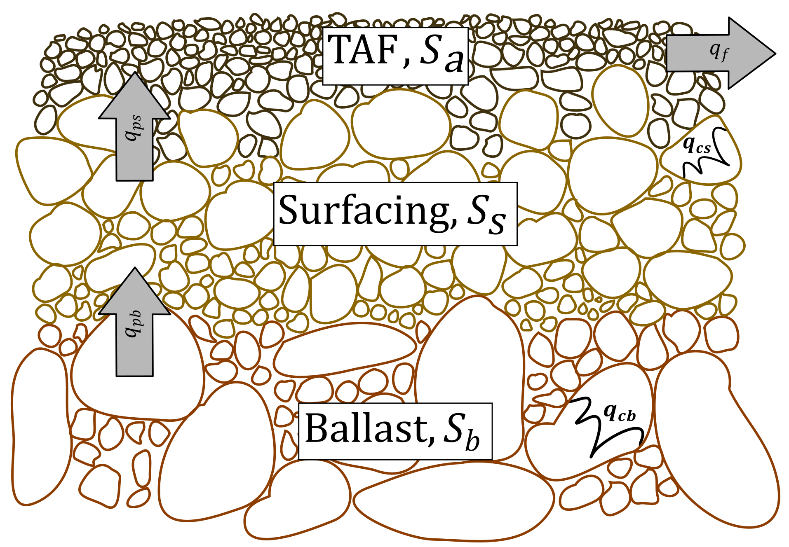
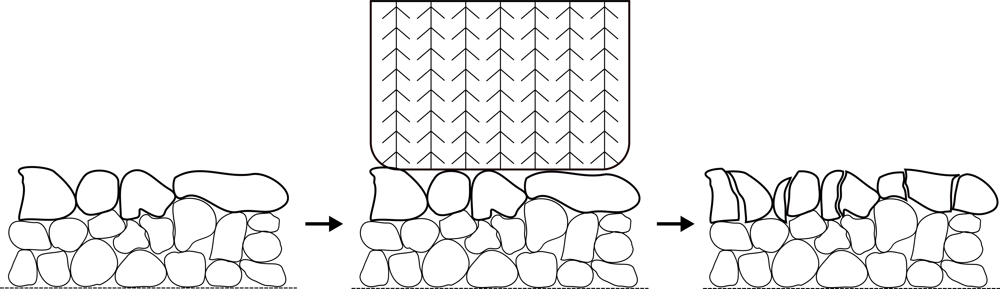
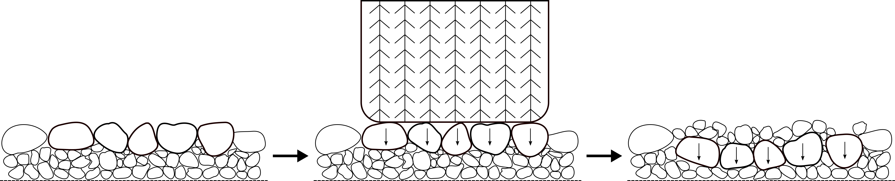
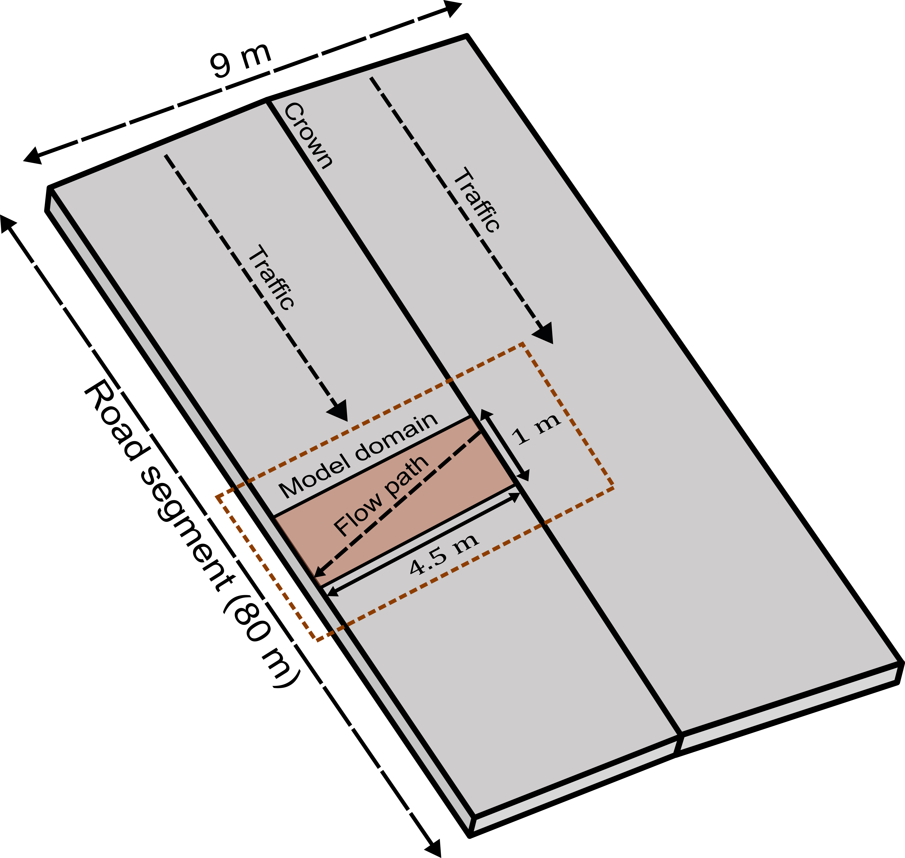

# WADNR Roads Project Lumped Model
**Updated:** 06/25/2025

## Summary
This repository contains code for a spatially lumped model used to estimate the erosion of forest roads.

## Model description
This spatially lumped model for estimating forest road erosion uses a tri-layered conceptualization (Figure 1) to demonstrate the vertical sediment exchange among layers of a road cross section and incorporates two of four traffic-induced, erosion-enhancing processes discussed in Alvis et al. (2023): pumping (Figure 2) and crushing (Figure 3).

||||
|:----------------------------------------------:|:---------------------------------------------:|:--------------------------------------------:|
|**Figure 1.** The tri-layered conceptualization that is used to model processes occurring vertically within the road prism.|**Figure 2.** Schematic of the crushing process. On a typical road surface aggregate (left) when traffic is applied (center) the larger sediment breaks down into finer sediment (right). Image not to scale.|**Figure 3.** Schematic of the pumping process. Larger sediment is layered over finer sediment (left) and when traffic is applied (center) the larger sediment gets pushed down which forces the finer sediment upwards (right). Image not to scale.|

The spatially lumped model also incorporates water-driven sediment transport to model the erosion process itself. The domain of the spatially lumped model is a 1-meter by 4.5-meter section within a larger road segment, where every meter-long section is assumed to have the same characteristics such that sediment production in one section can be extrapolated to every other section and summed to obtain the total sediment yield.

||
|:--:|
|**Figure 4.** Schematic of spatially lumped modeling domain within an 80-m by 9-m experimental road segment.|

#### References
Alvis, A. D., Luce, C. H., & Istanbulluoglu, E. (2023). How does traffic 
affect erosion of unpaved forest roads? Environmental Reviews, 31(1), 
182–194. https://doi.org/10.1139/er-2022-0032

## Repository navigation
### `rlm_data_scripts`
This folder contains four scripts used to format and plot input data for scripts in `rlm_model_runs`.

1. `dailyTimestep.py` is a script that groups rainfall data by day.
   - **Input** Raw rainfall data in a Pandas-readable format.
   - **Output** Pandas dataframe of rainfall data grouped by day.
2. `Emmett1970Data_script.py` is a script used to plot data from two different experiments discussed in Emmett (1970).
   - **Input:** Flow (q) and Manning's n data for two experiments in a Pandas-readable format. 
   - **Output:** Clean plots showing the relationship between q and n for two scenarios.
3. `groupStorms_script.py` is a script used to group rainfall data by storm.
   - **Input:** Raw rainfall data in a Pandas-readable format and a user-defined minimum threshold of time between storms.
   - **Output:** Pandas dataframe of rainfall data grouped by storm.
4. `pullRainfall.py` is a script used to pull rainfall data from rain gages near field sites using the Mesonet API. Note that
the Mesonet API is now known as the Synoptic Data API and is not free to use. This script is kept here for completeness.
   - **Input:** Station ID.
   - **Output:** Raw rainfall data in a Pandas-readable format.

### `rlm_model_runs`
This folder contains one script used to run the lumped road erosion model and a Jupyter notebook tutorial. Additionally includes an `archive` folder with old pieces of code that are out-of-date but are kept for record-keeping, as well as a `figs` folder with figures used for illustration in the tutorial. 

1. `rlm_daily_time_step.py` estimates the erosion of forest roads using rainfall data pulled from the Mesonet API and stochastically 
generated truck passes.
   - **Input:** Output from `dailyTimestep.py`.
   - **Output:** Plots of road layer depths vs. time and erosion vs. time.
2. `rlm_tutorial.ipynb` estimates the erosion of forest roads using rainfall data pulled from the Mesonet API and stochastically generated truck passes in a tutorial format.
   - **Input:** Output from `dailyTimestep.py`.
   - **Output:** Plots of road layer depths vs. time and erosion vs. time.